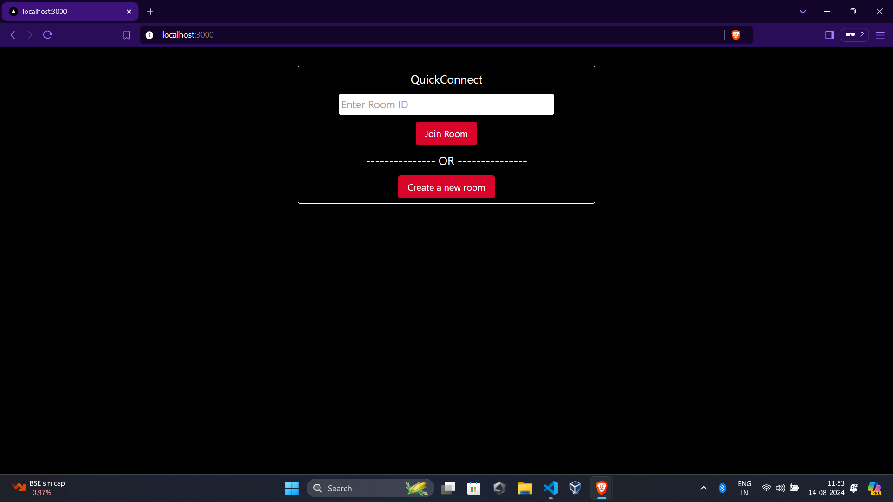
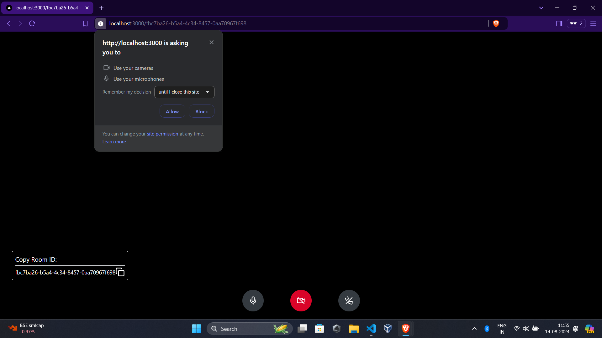
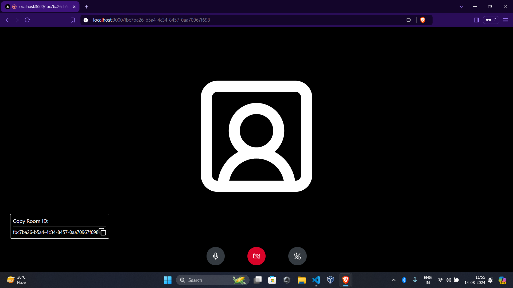

# QuickConnect

QuickConnect is a video chat application that allows users to connect and interact via live video streams. Hosted on AWS Cloud, QuickConnect provides scalable and reliable performance.

## Photo
###Home


###Permissions


###Interface


## Features

- **Real-time Video Chat**: Instantly connect with other users using high-quality video.
- **User Authentication**: Secure sign-in and session management.
- **Responsive Design**: Accessible on desktops, tablets, and smartphones.
- **Cloud Hosting**: Deployed on AWS Cloud for enhanced scalability and reliability.

## Installation

To get started with QuickConnect locally, follow these steps:

1. **Clone the repository:**

   ```bash
   git clone https://github.com/your-username/quickconnect.git
   ```

2. **Navigate to the project directory:**

   ```bash
   cd quickconnect
   ```

3. **Install dependencies:**

   ```bash
   npm install
   ```

4. **Create a `.env.local` file in the root directory and add your environment variables (if any).**

5. **Run the development server:**

   ```bash
   npm run dev
   ```

6. **Open your browser and visit `http://localhost:3000` to see the app in action.**

## Deployment

To deploy QuickConnect on AWS Cloud:

1. **Build the project:**

   ```bash
   npm run build
   ```

2. **Deploy the build files to your AWS server.**

3. **Configure your AWS instance to serve the static files and manage the server environment.**

## Usage

- **Join a Room**: Enter an existing room ID to start a video chat.
- **Create a Room**: Generate a new room ID to initiate a video chat session.
- **Toggle Audio/Video**: Manage your audio and video settings with the provided controls.

## Contributing

Contributions are welcome! To contribute to QuickConnect:

1. **Fork the repository.**
2. **Create a new branch:**

   ```bash
   git checkout -b feature/YourFeature
   ```

3. **Commit your changes:**

   ```bash
   git commit -am 'Add new feature'
   ```

4. **Push to the branch:**

   ```bash
   git push origin feature/YourFeature
   ```

5. **Create a Pull Request.**


